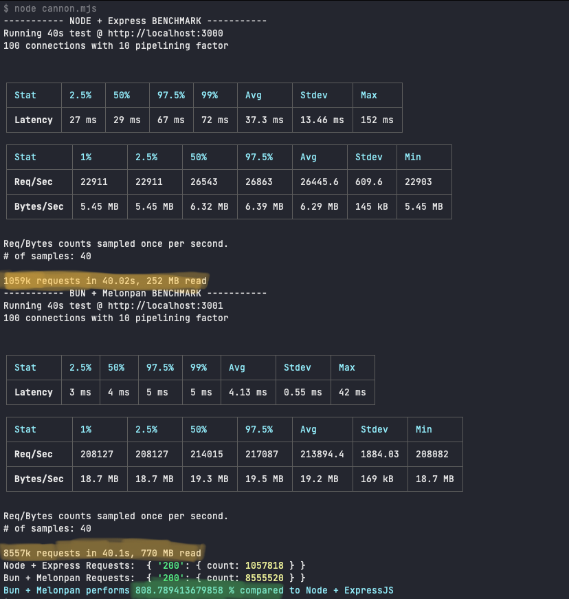

[](https://github.com/DarthBenro008/melonpan/blob/master/LICENSE)
[](https://www.npmjs.com/package/melonpan)
[](https://github.com/DarthBenro008/melonpan/issues/new/choose)

<p align="center"> <b>Melonpan</b> is a simple and minimalistic web-router designed to work with <b>Bun</b>, keeping performance in mind. </p>

## 🤔 Why Melonpan?

- **no/minimal** learning curve
- **Developer focused**, you just need to focus on buisness logic
- **0 bloat functions**
- **0 dependencies**
- **100% Typescript code**
- Blazing fast performance than node webframework alternatives

## ⚡️ Quickstart

```typescript
import { Melonpan, MelonRouter } from "melonpan";

const melonpan = new Melonpan();
// Simple middleware definitions
melonpan.use((_req, ctx, next) => {
    console.log("A middleware has been hit!")
})
// Easy query params parsing!
melonpan.get("/api/:id", (_req, ctx) => {
    return ctx.json(200, {"id": ctx.params.id});
})
// Routing done in very simple manner
melonpan.get("/" , (_req, ctx) => ctx.text(200, "Hello world!"));

// Easy definitions of routers and handlers!
const melonRouter = new MelonRouter();
melonRouter.get("/bar", (_req, ctx) => ctx.text(200, "this is a router"));
melonpan.use("/foo", melonRouter);

export default {
    port: 3000,
    fetch(req: Request){
        return melonpan.serve(req);
    }
}
```

## 🤖 Benchmarks

The following results are of: 
- **Test:** Bun `(v0.1.11)` + Melonpan `(v0.1.0)` **Vs** NodeJS `(v16.13.0)` + Express `(v4.18.1)`
- **Machine:** MacBook M1 Pro 16GB RAM
- **Benchmarking tool used:** [Autocannon](https://github.com/mcollina/autocannon)

### Results



> **Almost an 8x performance, thanks to Bun.**

You can find the [benchmark suite here](https://github.com/DarthBenro008/melonpan/tree/main/bench)


## ⬇️ Installation

### Using Bun

1. Install Bun  
```bash
curl https://bun.sh/install | bash
```
2. Add Melonpan as dependency using bun  
```bash  
bun add melonpan
```

### Using Yarn

```bash
yarn add melonpan
```

### Using NPM

```bash
npm install melonpan
```

## 🤝 Contributions

- Feel Free to Open a PR/Issue for any feature or bug(s).
- Make sure you follow the [community guidelines](https://docs.github.com/en/github/site-policy/github-community-guidelines).
- Feel free to open an issue to ask a question/discuss anything about melonpan.
- Have a feature request? Open an Issue!
- Please ensure to run `bun test` before submitting your PRs!

### 📢 Shoutouts

Shoutout to [Khyati Gupta](https://www.behance.net/khyatigupta267) for amazing logo and banner illustrations

## ⚖ License

Copyright 2022 Hemanth Krishna

Licensed under MIT License : https://opensource.org/licenses/MIT

<p align="center">Made with ❤ , multiple cups of coffee and some chaii</p>